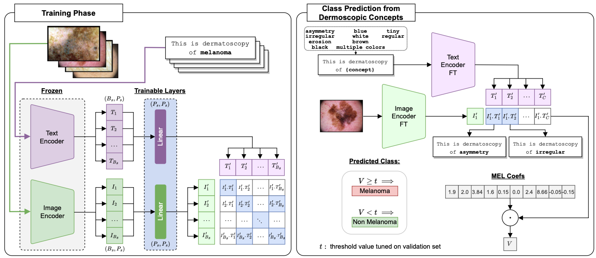

# Towards Concept-based Interpretability of Skin Lesion Diagnosis using Vision-Language Models [Oral]

[Paper](https://arxiv.org/abs/2311.14339) accepted at IEEE International Symposium on Biomedical Imaging - ISBI 2024.



---

### Citation

If you use this repository, please cite:

```
@article{patricio2023towards,
  title={Towards Concept-based Interpretability of Skin Lesion Diagnosis using Vision-Language Models},
  author={Patr{\'\i}cio, Cristiano and Teixeira, Lu{\'\i}s F and Neves, Jo{\~a}o C},
  journal={arXiv preprint arXiv:2311.14339},
  year={2023}
}
```

## 1. Download data
- **PH $^2$** dataset: https://www.fc.up.pt/addi/ph2%20database.html
- **Derm7pt** dataset: https://derm.cs.sfu.ca/Welcome.html
- **ISIC 2018** (Task 3) dataset: https://challenge.isic-archive.com/data/#2018

**Note:** *You should mask out the original images of each dataset with the available masks (download masks [here](https://ubipt-my.sharepoint.com/:u:/g/personal/cristiano_patricio_ubi_pt/EaYoENWGK3ZLvmMCrOgp6qcBu7v9-hK__lGr4yuKpkneVA?e=ywBfty)) in order to reproduce the results of the paper.*


## 2. Training 
### 2.1 Prepare conda environment

Create a new conda environment with the required libraries contained in requirements.txt file:

```bash
conda create --name cbi-vlm --file requirements.txt
```
### 2.2 Fine-Tune CLIP on Derm7pt and ISIC 2018

- Use the configuration file (`CLIP/modules/config.py`) to adjust settings for training:
    - `clip_model`: choose between {ViT-B/32, ViT-B/16, RN50, RN101, ViT-L/14, RN50x16}
    - `seed`: choose between {0, 42, 84, 168}
    - `dataset`: choose between {'derm7pt', 'ISIC_2018'}
    - `batch_size`: default 32
    - `image_embedding`: set accordingly to dim of each CLIP model
    - `text_embedding`: set accordingly to dim of each CLIP model
    - `projection_dim`: set accordingly to your preference
    - `path_to_model`: path of the trained model 

    *See suplementary document for more details on the architectures chosen.*

- Change image file paths according to your own file paths in `extract_image_embeddings` function [`CLIP/modules/utils.py`].

- Run train script [`CLIP/train.py`]:
 ```python
 python train.py
 ```

- Run inference script [`CLIP/inference.py`] (Extract image & text embeddings used for evaluation):
```python
 python inference.py
```

## 3. Evaluation

All required dataset splits are available under `/data` folder.

### 3.1. PH $^2$ dataset

- $k$-fold evaluation:

```bash
# CLIP - Baseline
python CLIP/scr_k_fold_evaluate_PH2_Baseline.py

# CLIP - CBM
python CLIP/scr_k_fold_evaluate_PH2_CBM.py

# CLIP - GPT-CBM
python CLIP/scr_k_fold_evaluate_PH2_GPT-CBM.py

# MONET - Baseline
python MONET/scr_k_fold_evaluate_PH2_Baseline.py

# MONET - CBM
python MONET/scr_k_fold_evaluate_PH2_CBM.py

# MONET - GPT-CBM
python MONET/scr_k_fold_evaluate_PH2_GPT-CBM.py

# Each of the above scripts will generate a numpy file with the results. Read the file to analyze the results.
```

- Individual evaluation (jupyter notebooks):
```bash
# CLIP - Baseline
CLIP/scr_Baseline_CLIP_PH2.ipynb

# CLIP - CBM
CLIP/scr_CBM_CLIP_PH2.ipynb

# CLIP - GPT-CBM
CLIP/scr_GPT-CBM_CLIP_PH2.ipynb

# MONET - Baseline
MONET/scr_Baseline_MONET.ipynb

# MONET - CBM
MONET/scr_CBM_MONET.ipynb

# MONET GPT-CBM
MONET/scr_GPT-CBM_MONET.ipynb
```

### 3.2. Derm7pt dataset

- Evaluation over four runs:

```bash
# CLIP - Baseline
python CLIP/scr_evaluate_derm7pt_Baseline.py

# CLIP - CBM
python CLIP/scr_evaluate_derm7pt_CBM.py

# CLIP - GPT-CBM
python CLIP/scr_evaluate_derm7pt_GPT_CBM.py


# Each of the above scripts will generate a numpy file with the results. Read the file to analyze the results.
```

- Individual evaluation (jupyter notebooks):
```bash
# CLIP - Baseline
CLIP/scr_Baseline_CLIP-derm7pt.ipynb

# CLIP - CBM
CLIP/scr_CBM_CLIP-derm7pt.ipynb

# CLIP - GPT-CBM
CLIP/scr_GPT-CBM_CLIP-derm7pt.ipynb

# MONET - Baseline
MONET/scr_Baseline_MONET.ipynb

# MONET - CBM
MONET/scr_CBM_MONET.ipynb

# MONET GPT-CBM
MONET/scr_GPT-CBM_MONET.ipynb
```

### 3.3. ISIC 2018 dataset

- Evaluation over four runs:

```bash
# CLIP - Baseline
python CLIP/scr_evaluate_ISIC_2018_Baseline.py

# CLIP - CBM
python CLIP/scr_evaluate_ISIC_2018_CBM.py

# CLIP - GPT-CBM
python CLIP/scr_evaluate_ISIC_2018_GPT_CBM.py


# Each of the above scripts will generate a numpy file with the results. Read the file to analyze the results.
```

- Individual evaluation (jupyter notebooks):
```bash
# CLIP - Baseline
CLIP/scr_Baseline_CLIP-ISIC_2018.ipynb

# CLIP - CBM
CLIP/scr_CBM_CLIP-ISIC_2018.ipynb

# CLIP - GPT-CBM
CLIP/scr_GPT-CBM_CLIP-ISIC_2018.ipynb

# MONET - Baseline
MONET/scr_Baseline_MONET-ISIC_2018.ipynb

# MONET - CBM
MONET/scr_CBM_MONET.ipynb

# MONET GPT-CBM
MONET/scr_GPT-CBM_MONET.ipynb
```

---

[Last update: Mon Feb 19 03:41:45 PM WET 2024]
